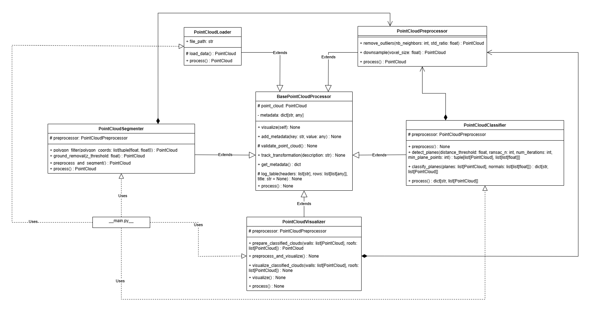

# pointcloud-oop

Python implementation of point cloud classification for roofs and walls using RANSAC for GmE 205.

# Point Cloud Classification of Roofs and Facades Using Object-Oriented Programming (OOP)

## Abstract

This project explores the application of Object-Oriented Programming (OOP) principles in the classification of roofs and facades from point cloud data. Leveraging modular and reusable code architecture, the study demonstrates a comprehensive pipeline for point cloud processing, segmentation, and classification, with an emphasis on scalability and maintainability.

## 1. Introduction

Point cloud data has become a critical asset in 3D modeling, urban planning, and geospatial analysis. However, processing and extracting meaningful information from such data can be challenging due to its unstructured nature. This paper focuses on classifying roofs and facades from point clouds using an object-oriented programming paradigm. The structured approach ensures a reusable and scalable framework while maintaining clarity and modularity in implementation.

### 1.1 Rationale Behind the Project

The rapid advancement of LiDAR technology and photogrammetry has enabled the acquisition of high-resolution point cloud data. While these datasets are highly detailed, they lack explicit structure, making it difficult to extract specific features like roofs and facades efficiently. Developing an automated, modular pipeline for classifying roofs and facades addresses a key need in urban modeling and related applications. This project leverages object-oriented programming to create a scalable, reusable framework that simplifies the processing, segmentation, and classification of point cloud data.

### 1.2 Significance of the Project

This project contributes to advancing research in 3D modeling and its related applications in the following ways:
 - **Urban Planning**: Efficient extraction of roofs and facades enables detailed city modeling, which supports urban planning and infrastructure development.
 - **Building Information Modeling (BIM)**: Automating the classification of building features like roofs and facades can streamline BIM workflows for architects and engineers.
 - **Disaster Management**: Accurate 3D models can assist in identifying structural damage to buildings after natural disasters.
 - **Solar Potential Estimation**: Extracting and analyzing roof planes aids in determining suitable areas for solar panel installations.
 - **Heritage Preservation**: Detailed classification of building exteriors facilitates 3D reconstruction for cultural heritage preservation

### 1.3 Objectives of the Project

The primary objectives of this project are:
1. To develop a modular pipeline for processing, segmenting, and classifying point cloud data.
2. To implement object-oriented programming principles for enhanced modularity, reusability, and scalability.
3. To accurately classify roofs and facades from point cloud data using geometric properties such as plane orientation and height thresholds.
4. To provide effective visualization of classified structures for further analysis.
5. To demonstrate the applicability of the developed pipeline for real-world 3D modeling and geospatial applications.

## 2. Methodology

### 2.1 Workflow Overview

The methodology followed a structured workflow, as shown in the figure below. The project began with loading the raw point cloud data, followed by preprocessing to remove noise and downsample the dataset. The cleaned data was then segmented to isolate regions of interest, such as building structures. Planar surfaces were detected from the segmented data and classified into roofs and facades based on their geometric properties. Finally, the results were visualized for further analysis and evaluation.

### 2.2 System Architecture

The system architecture, depicted in the following figure, consists of modular components implemented as Python classes. These classes were designed following object-oriented programming principles to ensure separation of concerns and reusability.

#### 1. Data Loading

The **PointCloudLoader** class handled the reading of `.laz` point cloud files. Using the `laspy` library, the raw data was extracted and converted into an Open3D-compatible point cloud object. This ensured compatibility with the Open3D library for further processing.

##### Attributes
- **`file_path`** (*str*): Path to the input `.laz` file.

##### Methods
- **`load_data()`**: Reads and processes the file into an Open3D point cloud.
- **`process()`**: Executes the data loading pipeline.

---

#### 2. Preprocessing

The **PointCloudPreprocessor** class was responsible for cleaning the raw point cloud data. This was done through:
- **Statistical Outlier Removal**: Filtering noise.
- **Voxel Grid Downsampling**: Reducing the point cloud density.

##### Methods
- **`remove_outliers(nb_neighbors, std_ratio)`**: Filters noisy points using statistical analysis.
- **`downsample(voxel_size)`**: Reduces data density using voxel grid filtering.
- **`process()`**: Runs the preprocessing steps sequentially.

---

#### 3. Segmentation

The **PointCloudSegmenter** class isolated building structures from the preprocessed data. This involved:
- **Polygon-based Filtering**: Retaining points within a specific spatial extent.
- **Ground Removal**: Eliminating points below a height threshold.

##### Methods
- **`polygon_filter(polygon_coords)`**: Applies spatial filtering using a user-defined polygon boundary.
- **`ground_removal(z_threshold)`**: Removes ground-level points based on Z-coordinate values.
- **`preprocess_and_segment()`**: Combines preprocessing and segmentation tasks.

---

#### 4. Classification

The **PointCloudClassifier** detected and classified planar surfaces into roofs and facades. The process included:
- **Plane Detection**: Using the RANSAC algorithm to extract flat surfaces from the segmented point cloud.
- **Classification**: Analyzing the orientation of each plane's normal vector and its height to distinguish between walls and roofs.

##### Methods
- **`detect_planes()`**: Identifies planar surfaces using the RANSAC algorithm.
- **`classify_planes(planes, normals, min_roof_height)`**: Classifies planes into walls (vertical) and roofs (horizontal).
- **`process()`**: Executes the entire classification pipeline.

---

#### 5. Visualization

The **PointCloudVisualizer** rendered the results for analysis. Classified walls were colored blue, and roofs were colored red to provide a clear visual distinction.

##### Methods
- **`prepare_classified_clouds(walls, roofs)`**: Combines walls and roofs into a single colored point cloud.
- **`visualize()`**: Displays the current point cloud.
- **`visualize_classified_clouds(walls, roofs)`**: Visualizes walls and roofs with assigned colors.

-----------------------edit this-------------------

### 2.3 Pipeline Execution

The workflow proceeded as follows:

1. The PointCloudLoader loaded the raw .laz point cloud file.
2.	The PointCloudPreprocessor cleaned the data by removing outliers and downsampling.
3.	The PointCloudSegmenter filtered the data to isolate building structures and removed ground points.
4.	The PointCloudClassifier detected planar surfaces and classified them into roofs and facades.
5.	The PointCloudVisualizer rendered the final results for analysis

Each stage in the pipeline was implemented as an independent class, ensuring modularity, reusability, and scalability. The detailed execution of these stages, combined with the structured object-oriented design, allowed for an efficient and maintainable point cloud classification process.

## 3. Results

The pipeline was tested on the plaza roma point cloud, a subset of Intramuros drone imagery data provided by Datum PH to OpenStreetMap Philippines under the 2021 Drone Imagery Collection Grant by Datum & OSMph. The results demonstrate accurate classification of roofs and facades, with effective visualization of the outcomes. However, some improvements can still be made. Key results include:
 - Number of detected planes: 20
 - Number of classified roofs: 6
 - Number of classified walls: 14

## 4. Discussion

### 4.1 Advantages of the OOP Approach

 - Modularity: Independent classes facilitate easier debugging, testing, and maintenance.
 - Reusability: Classes can be adapted for similar projects with minimal modifications.
 - Scalability: New functionalities can be added without affecting existing code.

### 4.1 Challenges and Limitations

 - Performance: Processing large point cloud datasets can be computationally intensive
 - Accuracy: The quality of classification depends on point cloud density and noise levels

## 4. Conclusion

This project demonstrates a robust, modular pipeline for point cloud classification of roofs and facades using object-oriented programming. By providing an efficient and reusable framework, the study contributes to advancing 3D modeling, urban planning, and related geospatial applications. Future work includes optimizing computational performance and integrating machine learning techniques for improved classification accuracy.

## References

- Open3D Documentation. Retrieved from https://www.open3d.org/
- laspy Documentation. Retrieved from https://laspy.readthedocs.io/
- Plaza Roma Dataset. Retrieved from https://github.com/maning/plaza-roma-imagery/
